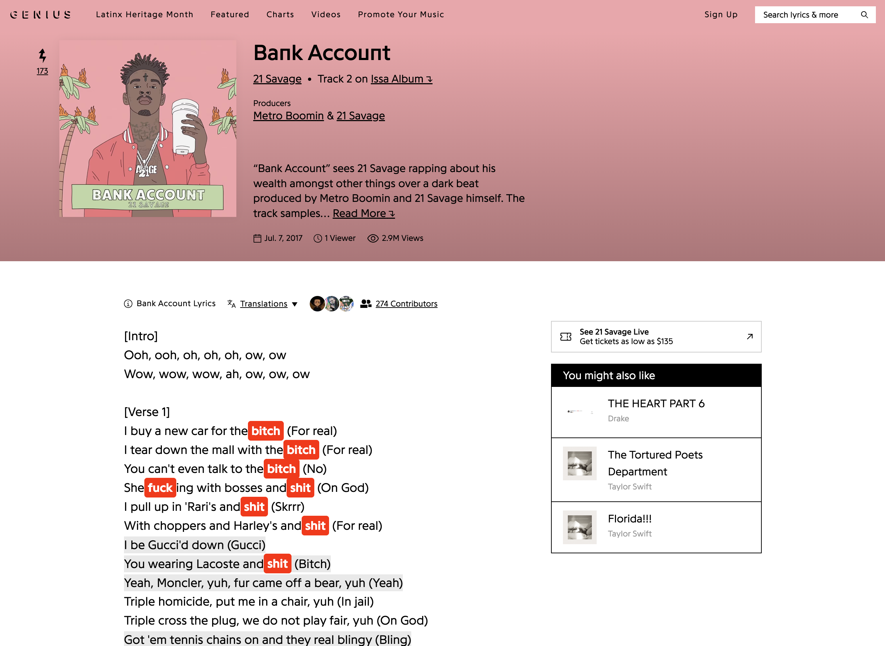
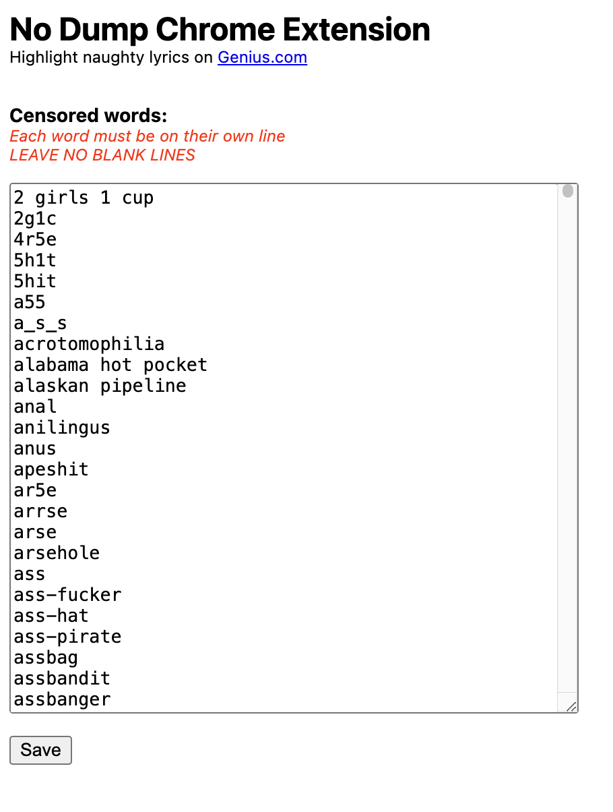

# No Dump

Highlight bad words on Genius

Warning: this code and screenshots below show a lot of curse words

## Why

When DJing on college radio, we can play any song we want as long as we censor the curse words. Usually, this is done by the radio DJ following along with the lyrics from Genius and hitting the mute button when a bad word comes up.

It is hard to read lyrics, listen to the music, see a bad word come up, and time the mute button all at once.

Sometimes, when reading, bad words slip past and you miss the mute!

To fix this, I created a chrome extension that clearly highlights curse words (or any words really) on Genius, making it 1000000% easier for radio DJs to follow along with a song's lyrics and know when to mute.

This is what it looks like:

## Set up

- pull this repo locally
- go to your chrome extension setting page and click "load unpacked"
- select the repo folder
- done - now any genius lyric page will have bad words highlighted

To change the word list, go to the extension options page and add any words you want. The initial list of words was picked from Google's profanity list: https://raw.githubusercontent.com/coffee-and-fun/google-profanity-words/refs/heads/main/data/en.txt

